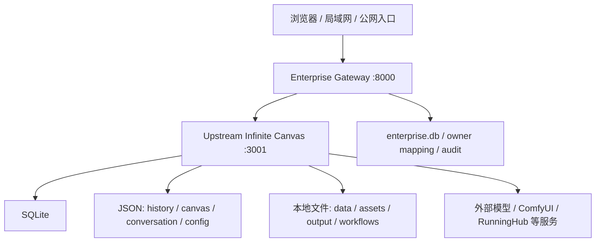

# ARCH-2A：整体架构评估与演进方向（2026-07）

更新时间：2026-07-10
代码核对基线：`main@a095ce2eb9ef9afda356cb6f20b6c38851f52b1d`

## 1. 文档定位

本文是 Infinite-Canvas-Enterprise 当前架构评估和后续演进方向的事实基线。当前系统的统一定位是：

> 已投入生产的企业安全增强型单机模块化单体。

本文用于后续任务拆解、PR 审查和 Codex 开发时区分当前事实与目标规划，但不表示 ARCH-2A 已经实施任何架构整改。

本文不替代：

- 具体功能设计。
- 数据库 migration 方案。
- Docker / 1Panel 实施方案。
- 生产 release、restore、upgrade 或 rollback 计划。
- 协作 ACL 设计。

后续每个实现阶段仍需独立 Issue、独立分支、独立 Draft PR、针对性测试和项目负责人确认。任何生产动作仍由项目负责人在生产主机本地人工执行，Codex 不直接连接生产主机。

状态用语统一如下：

| 状态 | 含义 |
| --- | --- |
| 当前已实现 | 在本基线代码中可以直接定位到实现，并已有相应测试或运行记录。 |
| 当前部分实现 | 已有基础能力，但闭环、覆盖面或生产验证仍不完整。 |
| 已确认但尚未实施 | 项目负责人已确认方向，本基线没有对应完成态实现。 |
| 长期目标 | 只有在前置条件满足后才进入的能力。 |
| 待专项验证 | 已观察到风险信号，但需要独立任务确认影响、设计修复和补测试。 |

## 2. 当前架构还原

### 2.1 运行链路



当前 Windows 生产采用双进程模型：

1. `enterprise/launcher.py` 使用同一 Python 运行时启动 `main:app`，监听 `127.0.0.1:3001`。
2. 上游端口就绪后，启动 `enterprise.gateway:app`，监听 `0.0.0.0:8000`。
3. 浏览器只应通过 `8000` 进入；`3001` 是本机内部服务边界。
4. launcher 负责当前进程生命周期和 Windows Job Object 尽力清理，但不是完整生产服务管理器。

### 2.2 分层职责

| 层 | 当前职责 | 主要实现 |
| --- | --- | --- |
| 企业入口 | 登录、JWT Cookie、页面门禁、HTTP / WebSocket 反向代理、企业 UI 注入 | `enterprise/gateway.py` |
| 认证 | 密码认证、JWT 创建与校验 | `enterprise/auth.py`、`enterprise/db.py` |
| 请求前置授权 | 项目、画布、对话、资源、历史、任务、素材和高风险设置的路径识别与拒绝 | `enterprise/interceptors.py:pre_process` |
| 响应后置治理 | 列表过滤、敏感设置脱敏、owner 写入、资源回填、企业 app-info 治理、合成事件 | `enterprise/interceptors.py:post_process` |
| owner mapping | 用户与项目、画布、对话、资源、历史、任务、素材对象的归属映射 | `enterprise/db.py`、`data/enterprise.db` |
| WebSocket 可见性 | enterprise connection 绑定、敏感事件过滤、按用户合成广播 | `enterprise/ws.py` |
| 管理 API | 用户生命周期、feature flags、owner 分配、审计查询 | `enterprise/admin_api.py` |
| 企业管理前端 | 登录、个人中心、成员 / 归属 / 权限 / 日志管理 | `enterprise-static/` |
| 上游业务核心 | 画布、对话、生成、工作流、素材库、历史、任务和外部 provider 调用 | `main.py`、`static/`、`workflows/`、`API/` |
| OPS | inventory、check-data、backup、validate-release、prepare-upgrade 和 Windows wrapper | `enterprise/ops/`、`tools/ops/windows/` |

### 2.3 当前数据与状态模型

当前不是单一数据库系统，而是混合存储：

- 企业身份、owner map、feature flags、user overrides、审计：`data/enterprise.db`。
- 画布、对话、项目、素材、工作流和 provider 配置：SQLite 之外的多份 JSON / 目录文件。
- 生成历史：`history.json` 全局文件。
- 上传、素材和输出：`assets/`、`output/` 与其它本地目录。
- 上游运行状态：`main.py` 中的进程内 queue、lock、WebSocket connection、task dictionary 和全局变量。
- 企业 WebSocket connection registry：`enterprise/ws.py` 的单进程内存状态。

企业数据库当前不会替代上游业务文件。企业层先让上游完成业务写入，再在响应后记录 owner 的路径仍然存在，因此上游对象与 owner map 不是同一事务。

## 3. 当前架构定位

### 3.1 当前是

- 企业安全增强型。
- 单机部署。
- 模块化单体。
- 企业网关保护上游。
- SQLite / JSON / 本地文件系统混合存储。
- Windows 生产优先。
- 已有真实生产用户与真实业务数据。
- owner 隔离为当前多用户安全模型核心。
- 通过离线发布、备份、报告和人工维护窗口逐步建设生产治理。

### 3.2 当前不是

- 微服务平台。
- 分布式平台。
- 多服务器平台。
- 高可用平台。
- 零停机升级平台。
- Docker-ready 完成态。
- 1Panel-ready 完成态。
- PostgreSQL 完成态。
- Redis / durable queue 完成态。
- MinIO / S3 / NAS 对象存储完成态。
- 完整 team / workspace / collaboration ACL 平台。

不能用 httpx `max_connections=200` 推导可承载 200 个并发用户，不能用 SQLite WAL 推导高并发问题已经解决，也不能把单进程 WebSocket registry 解释为多实例可用。

## 4. 当前架构优点

1. 企业层与上游覆盖区基本分离。企业功能主要位于 `enterprise/`、`enterprise-static/` 和企业数据库中，有利于受控同步上游。
2. `8000` 企业入口和 `3001` 本机内部服务形成了清晰的部署边界，企业认证与授权可以集中在统一入口执行。
3. 保留上游主应用作为业务能力核心，避免为了企业化重写画布、生成、素材和工作流能力。
4. owner map 模型已覆盖项目、画布、对话、资源、历史、任务和素材对象，能够满足当前小规模企业多用户隔离。
5. SQLite 便于当前 Windows 单机部署、备份和本地诊断，适合现阶段容量与运维条件。
6. `pre_process` 与 `post_process` 已形成前置鉴权、响应过滤和 owner 记录的基础闭环。
7. user A、user B、admin 的临时数据库隔离测试已覆盖多个关键数据域，并且测试不触碰生产数据。
8. WebSocket 已对已知敏感事件实施 owner / task / resource 可见性治理，并阻止原始 `new_image` 直接向普通用户广播。
9. OPS-2A 已提供 inventory、check-data、backup、validate-release、prepare-upgrade 和本地 job JSONL；OPS-2B 已提供 Windows bundled Python 直调 runner 的封装。
10. 离线发布、完整备份、生产副本演练、维护窗口和人工回滚验证的路线符合当前生产隔离现实。
11. 当前阶段继续模块化单体、暂不立即微服务化，可以把工程投入集中到安全、数据一致性、恢复能力和可观测性。

## 5. 当前主要架构风险

本节区分“已观察到的代码事实”和“需要后续专项验证的风险”。这些内容不等同于已发生数据泄露、数据损坏或生产故障。

### 5.1 安全与鉴权

已观察到的代码事实：

- `enterprise/auth.py:create_token` 将 `is_admin` 写入 JWT；`verify_token` 只确认用户仍存在且激活，未重新加载数据库中的角色状态。
- 密码修改、管理员重置密码、角色修改和用户启用 / 禁用没有统一 `session_version` / `token_version` 撤销机制。禁用用户会因查询不到 active user 而失效，但重新启用后，未过期旧 Token 仍缺少版本级撤销保证。
- `enterprise/db.py:get_effective_feature_value` 对管理员直接返回 allowed，`system_update` 全局 flag 不能约束管理员；`enterprise/config.py` 的 `ENTERPRISE_UPDATE_ENABLED` 默认值为 `true`。
- 登录 Cookie 设置 `HttpOnly` 和 `SameSite=Lax`，但未设置 `Secure`。
- 企业管理写接口使用 Cookie 会话，但当前未见 CSRF token / origin 验证基线。
- 登录接口未见专用限流或失败次数治理。
- 登录页直接使用 query 中的 `next` 设置 `location.href`，服务端也未限制为站内相对路径。
- `/enterprise-static/{filename:path}` 通过目录拼接读取文件，未见 `resolve` 后 containment 校验。
- gateway 和部分管理 API 会把 `str(exception)` 直接返回响应，生产错误脱敏不完整。

待专项验证与整改：

- 设计 session / token version，并明确密码修改、角色修改、禁用、soft delete 和管理员强制登出的撤销语义。
- 复核 `system_update` 的管理员 bypass、高危操作审批和生产总开关语义。
- 对 Cookie Secure、CSRF、登录限流、`next` URL、静态文件 containment 和错误响应建立专项安全测试。

### 5.2 策略治理

已观察到的代码事实：

- HTTP 权限策略依赖 `enterprise/interceptors.py` 中大量路径集合、前缀判断和 payload 提取。
- `pre_process` 对已经识别的数据域执行拒绝，但未命中任何分类的上游路径最终返回 `None`，即默认放行。
- `enterprise/ws.py` 对已知敏感事件执行严格判断，但普通用户对未知且非敏感事件当前最终返回 `True`。
- 前端注入和页面隐藏已存在，但真正安全边界仍由后端 gateway / interceptor / WebSocket policy 决定。

待专项验证与整改：

- 建立显式 HTTP route registry，新增上游 API 未分类时 fail closed。
- 建立 WebSocket event registry，普通用户未知事件默认拒绝。
- 上游同步必须输出新增 / 变更 API 与 WebSocket event 的分类差异报告。
- 保持“前端隐藏只改善体验，不能替代后端授权”的验收标准。

### 5.3 数据一致性

已观察到的代码事实：

- 上游业务文件与 enterprise owner map 分属 JSON / 文件系统和 SQLite，无法形成跨存储事务。
- `post_process` 在上游创建成功后才记录 canvas、project、conversation、task、resource 和 history owner；记录失败只输出日志，业务对象可能已经存在。
- `history.json` 采用全文件读取、修改和重写；同一进程内有 `HISTORY_LOCK`，但不构成跨进程事务或崩溃恢复机制。
- `enterprise/db.py` 在初始化中直接执行建表与条件性 `ALTER TABLE`，当前没有正式 schema version 和 migration history。
- SQLite 连接启用 WAL，但当前未配置显式 `busy_timeout`，也未因此获得跨存储一致性。
- 项目负责人回报生产 `check-data` 当前仍为 warn，存在 unowned、orphan map、missing file 等需要人工治理的差异；工具不会自动修复。

待专项验证与整改：

- 建立 schema version、migration runner、migration history 和临时数据库回归。
- 建立 owner reconciliation 报告、人工修复 plan 和审计流程，禁止自动修复生产 owner map。
- 为 owner 写入失败设计可重试的 outbox / reconciliation 机制，而不是在本轮直接改变上游写入流程。
- 对 `history.json` 的原子写入、并发访问和 owner 映射同步做专项设计。

### 5.4 性能与扩展性

已观察到的代码事实：

- gateway 在进入 `_forward` 前调用 `request.body()`；httpx 使用 `content=body`，上游响应再通过 `upstream_resp.content` 全量读取。
- `is_stream_path` 当前只是决定是否跳过后置拦截，命名不等于端到端真正流式代理；SSE 响应也会先成为完整 response body 才进入 owner 记录路径。
- 资源 owner 回溯和项目检查存在扫描 canvas / conversation JSON 或目录的在线路径。
- async handler 中仍会调用同步 SQLite、同步文件读取和全文件 JSON 操作。
- `main.py` 和 `enterprise/ws.py` 均保存单进程 WebSocket 状态；`main.py` 还保存 queue、task dictionary、backend load、login session 和多个线程锁。
- 部分任务通过 `asyncio.create_task` 保存到进程内字典；服务重启后任务状态可能消失。

待专项验证与整改：

- 建立真正的 request / response streaming、SSE 和大文件代理实现，并验证 timeout、backpressure 与中断传播。
- 增加上传大小限制和正式负载测试基线，不承诺未经压测的容量数字。
- 把在线目录扫描迁移为索引或离线 reconciliation。
- 把同步 SQLite / 文件操作从 event loop 热路径隔离。
- 在 realtime / queue adapter 完成前，不直接增加多个 Uvicorn worker，也不宣称可水平扩容。

### 5.5 可维护性

已观察到的代码事实：

- `main.py`、`enterprise/interceptors.py`、`enterprise/db.py`、`enterprise/gateway.py` 和 `enterprise-static/admin.html` 已形成大型模块。
- `interceptors.py` 同时承担路由识别、授权、过滤、owner 记录、设置脱敏、审计触发和 WebSocket 合成事件协调。
- `db.py` 同时承担 schema 初始化、密码、用户、owner、feature flags、user overrides 和审计数据访问。
- 当前缺少统一 repository / service / policy 分层。
- 根 `requirements.txt` 多数依赖未固定版本；企业附加依赖只固定了 PyJWT 和 websockets，尚无完整可复现依赖锁。

待专项验证与整改：

- 渐进拆分 policy、service、repository；每次只迁移一个数据域并保持 API 行为兼容。
- 建立依赖锁定、bundled Python 与标准 Python 的可复现安装验证。
- 不在普通功能 PR 中整体重写 `interceptors.py` 或 `db.py`。

### 5.6 运维与恢复

已观察到的代码事实：

- OPS 已有 inventory、check-data、backup、validate-release 和 prepare-upgrade。
- `backup --execute` 使用 `sqlite3.Connection.backup()` 生成一致性 SQLite 副本；但已有 backup 不等于 restore 已实现或恢复演练已完成。
- `prepare-upgrade` 只生成 plan，不停止服务、不替换文件、不迁移、不回滚。
- 当前没有 apply-upgrade、restore executor、rollback executor 或网页 Update Center 执行闭环。
- 当前没有 Dockerfile、Compose、容器日志规范和完整容器 healthcheck。
- 当前只有 usage audit、OPS job JSONL 和进程输出，不是完整 access / app / error / security / metrics 体系。
- Windows launcher 管理双进程，但不是服务自动恢复、日志轮转、告警和维护编排系统。

待专项验证与整改：

- 优先完成 restore rehearsal 和人工回滚验证，再讨论生产 apply-upgrade。
- 建立结构化日志、request_id / job_id、指标、磁盘 / DB / task / WebSocket 健康检查。
- Docker / 1Panel 继续作为单机生产化目标，不能跳过数据治理和恢复演练。

## 6. 目标架构原则

后续演进遵循以下原则：

1. 保留上游主应用作为业务能力核心。
2. 企业网关继续作为统一安全边界。
3. 优先模块化单体，不立即拆微服务。
4. 所有上游 HTTP API 和 WebSocket 事件必须显式分类。
5. 普通用户对未知、无归属、未分类对象默认拒绝。
6. 管理员权限也必须受生产总开关、高危操作确认和审计约束。
7. 数据访问逐步通过 repository / service 抽象，为 PostgreSQL 做准备。
8. 文件访问逐步通过 storage adapter 抽象，为 MinIO / S3 / NAS 做准备。
9. WebSocket 和任务状态逐步通过 realtime / queue adapter 抽象，为 Redis 和 durable queue 做准备。
10. OPS manifest、release、backup、restore 和 upgrade plan 保持平台无关。
11. Windows、Linux、Docker 和 1Panel 复用同一套运维事实模型，只替换执行器。
12. 不以微服务数量作为架构先进性的判断标准。
13. 不把未来规划写成当前已经支持的能力。

## 7. 推荐目标模块结构

以下是长期规划，尚未全部实现；ARCH-2A 不创建这些目录：

```text
enterprise/
  security/
    authentication
    session
    csrf
    rate_limit

  policies/
    route_registry
    project_policy
    canvas_policy
    conversation_policy
    resource_policy
    task_policy
    history_policy
    settings_policy
    websocket_policy

  services/
    user_service
    ownership_service
    history_service
    resource_service
    task_service
    audit_service

  repositories/
    user_repository
    ownership_repository
    feature_repository
    audit_repository
    migration_repository

  adapters/
    upstream_http
    upstream_websocket
    local_storage
    object_storage

  realtime/
    local_hub
    redis_hub

  observability/
    access_log
    app_log
    error_log
    security_log
    metrics

  ops/
    inventory
    backup
    restore
    release
    validation
    upgrade_plan
```

演进方式应是“保留现有入口，逐域抽取”，而不是先创建空目录或一次性迁移全部代码。

## 8. 演进阶段与优先级

### 8.1 ARCH-2B / SEC-1：安全边界整改，P0

- JWT 角色与数据库状态同步。
- session / token version。
- 用户禁用、密码修改、角色修改后的旧 Token 失效。
- `system_update` 管理员 bypass 整改。
- `ENTERPRISE_UPDATE_ENABLED` 默认策略统一。
- HTTP 未分类路由默认拒绝。
- WebSocket 未知事件默认拒绝。
- Secure Cookie。
- CSRF。
- 登录限流。
- `next` URL 校验。
- 企业静态文件路径 containment。
- 生产错误响应脱敏。
- 依赖声明补齐和版本锁定。

这些项目应拆成多个可审查 Issue，不在单个 PR 中打包完成。

### 8.2 ARCH-3：企业策略模块化，P1

- 建立 route registry。
- 按项目、画布、对话、资源、历史、任务、设置和 WebSocket 拆 policy。
- 渐进拆分 `interceptors.py`，不一次性大重构。
- 每个数据域独立迁移、测试和回滚。
- 保持现有 API 行为兼容。

### 8.3 DATA-1：数据访问层与迁移基础，P1

- repository 接口。
- schema version。
- migration history。
- SQLite `busy_timeout`。
- 索引、唯一约束和外键策略复核。
- owner reconciliation。
- check-data 与人工修复计划。
- 不自动修复生产 owner map。

### 8.4 PERF-1：性能与流式代理，P1

- 真正流式上传和下载。
- SSE / 大文件代理。
- 上传大小限制。
- timeout、取消传播和背压。
- 去除在线全目录扫描。
- SQLite / 文件操作异步隔离。
- 正式负载测试基线。

### 8.5 OBS-1：可观测性，P1 / P2

- access log。
- app log。
- error log。
- security log。
- operation / OPS job log。
- request_id / job_id。
- 指标。
- 磁盘空间、数据库、任务和 WebSocket 健康检查。

### 8.6 OPS-3 / OPS-4：恢复与升级闭环，P1 / P2

建议顺序：

1. release builder。
2. release validator 增强。
3. backup restore rehearsal。
4. 人工维护窗口升级演练。
5. 人工 rollback 验证。
6. 最后才考虑网页 Update Center 的 apply-upgrade。

在 restore 和 rollback 未完成演练前，不应把生产 apply-upgrade 接入网页管理后台。OPS-2A 的 `prepare-upgrade` 不是 upgrade 执行器。

### 8.7 OPS-D1：Docker / 1Panel 单机生产化，P2

- Linux entrypoint。
- 单容器双进程管理。
- Dockerfile。
- Compose。
- volume。
- healthcheck。
- 容器日志。
- HTTPS。
- WebSocket proxy。
- 上传大小与长任务 timeout。
- 计划任务备份。

本阶段开始和完成前都不得宣称当前已经 Docker-ready。

### 8.8 DATA-2 / SCALE-1：长期多服务器能力，P3

- PostgreSQL。
- Redis。
- durable task queue。
- Redis Pub/Sub 或等价 realtime backbone。
- MinIO / S3 / NAS。
- 多实例 session。
- 集中日志。
- 多服务器健康检查。
- 高可用与灾备。

### 8.9 TEAM-1：长期团队协作能力，P3

- workspace / organization。
- member roles。
- ACL / grants。
- team resources。
- project collaboration。
- resource sharing。
- invite / revoke。
- 审计与合规。

## 9. 架构决策表

| 技术 / 决策 | 当前选择 | 当前理由 | 何时继续保留 | 何时需要升级 |
| --- | --- | --- | --- | --- |
| 模块化单体 vs 微服务 | 模块化单体 | 团队和部署规模小，上游能力集中，优先解决安全与数据闭环 | 单机、单团队、单发布单元仍可管理 | 独立扩缩容、故障域或组织边界出现明确证据时评估服务拆分 |
| FastAPI | gateway 与上游均使用 FastAPI | 与现有 Python 上游一致，异步 HTTP / WS 支持成熟 | 当前 API、代理和管理面继续使用 | 不是优先替换项；只有明确性能或生态阻塞才评估 |
| Gateway | `8000` 企业网关保护 `3001` 上游 | 集中认证、授权、过滤，减少侵入上游 | 单一安全入口和上游兼容仍有效 | 多实例时需要无状态化、集中 session / realtime 和更严格策略 registry |
| SQLite | enterprise DB | 单机简单、部署成本低、可用一致性备份 | 小规模单写为主、维护窗口可接受 | 锁竞争、查询复杂度、多实例或 HA 需求达到验证阈值时迁 PostgreSQL |
| JSON | 上游业务兼容存储 | 保留上游行为，便于受控同步 | 低频配置和小规模文档仍适合 | 高频并发写、跨对象事务、查询和审计需求出现时迁移数据库 |
| 本地文件系统 | data / assets / output | Windows 单机直观，现有上游依赖强 | 单机容量、备份窗口和恢复时间可接受 | 多实例、容量、共享、生命周期或灾备要求提升时引入 storage adapter |
| JWT | Cookie 中的 HS256 JWT | 部署简单，gateway 可本地验证 | 短期在加入 token version、Secure Cookie、CSRF 后保留 | 集中身份、SSO、多实例或更强撤销需求出现时评估 session / IdP |
| WebSocket 内存状态 | gateway 与上游进程内 registry | 当前单进程最简单 | 单实例且断线重连可接受 | 多 worker / 多实例时必须迁 realtime adapter / Redis 等共享层 |
| Windows launcher | bat + bundled Python + 双进程 launcher | 符合当前生产现实 | 当前 Windows 单机维护期 | 需要服务自动恢复、Linux、容器或标准化部署时升级进程管理 |
| Docker | 未实施，仅有蓝图 | 安全、数据与恢复优先 | 当前 Windows 生产未迁移前维持规划状态 | OPS-D1 完成 entrypoint、volume、healthcheck、日志和验收后采用 |
| PostgreSQL | 未实施，长期优先目标 | 当前没有迁移基础和多实例前置条件 | SQLite 风险仍可控时继续准备 | DATA-1、备份恢复、schema migration 和副本演练完成后实施 |
| Redis | 未实施 | 当前单实例不需要额外组件 | 单进程 realtime / task 边界仍可接受 | 多实例 session、Pub/Sub、队列或分布式锁有明确需求时引入 |
| 对象存储 | 未实施 | 当前本地盘与上游路径耦合 | 单机文件量和备份恢复可管理 | 多服务器、生命周期、共享访问或灾备要求出现时引入 |

## 10. 非目标与禁止事项

后续开发不得：

- 为了“架构先进”立即微服务化。
- 在没有测试的情况下整体重写 `interceptors.py`。
- 直接修改生产数据库。
- 自动修复生产 owner map。
- 在生产执行 `git pull`。
- 在生产 `checkout main`。
- 用开发仓库直接覆盖生产目录。
- 在没有备份和恢复演练时升级。
- 为了权限控制只隐藏前端按钮。
- 把 Docker、PostgreSQL、Redis、MinIO 写成已实现。
- 把 apply-upgrade、restore 或 rollback 写成已实现。
- 把 production backup success 写成生产已经升级。
- 把架构规划当成当前代码事实。
- 把 WAL、连接池参数或单机 WebSocket 当作容量与扩展性证明。

## 11. 后续任务拆解规则

1. 每一个 P0 / P1 / P2 / P3 项目都需要独立 Issue。
2. 每个任务必须使用独立分支。
3. 每个任务先创建 Draft PR，等待主对话与项目负责人复核。
4. 每个安全策略变更至少覆盖 user A、user B、admin。
5. 每个权限变更覆盖列表过滤、直接 ID、资源 URL、刷新 / 重登和 WebSocket；不适用项必须在 PR 说明中写明。
6. 每个数据迁移任务必须有 dry-run、备份、回滚和临时数据库测试。
7. 每个生产动作必须由项目负责人人工执行，并回传脱敏结果。
8. Codex 不直接连接生产主机，不执行生产命令。
9. 不允许普通功能 PR 顺手完成大规模架构重构。
10. 上游同步必须重新核对新增 HTTP route、WebSocket event、存储路径和配置键。
11. 未经 restore rehearsal，不得把 backup manifest 视为恢复能力证明。

## 12. 事实来源与相关文档

本评估基于本基线的以下实现与文档核对：

- 快速架构总览：[ENTERPRISE-ARCHITECTURE-BLUEPRINT-2026-07.md](./ENTERPRISE-ARCHITECTURE-BLUEPRINT-2026-07.md)
- 当前状态：[CURRENT_PROJECT_STATUS.md](../CURRENT_PROJECT_STATUS.md)
- 开发路线：[DEVELOPMENT-ROADMAP-2026-2027.md](../roadmap/DEVELOPMENT-ROADMAP-2026-2027.md)
- 隔离矩阵：[ENTERPRISE_ISOLATION_MATRIX.md](../../ENTERPRISE_ISOLATION_MATRIX.md)
- 权限设计：[ENTERPRISE_PERMISSION_DESIGN.md](../../ENTERPRISE_PERMISSION_DESIGN.md)
- OPS-2A：[OPS-2A-PRODUCTION-OPS-TOOLKIT-2026-07.md](../ops/OPS-2A-PRODUCTION-OPS-TOOLKIT-2026-07.md)
- OPS-2B：[OPS-2B-WINDOWS-OPS-WRAPPER-2026-07.md](../ops/OPS-2B-WINDOWS-OPS-WRAPPER-2026-07.md)
- Docker / 1Panel 蓝图：[DOCKER-1PANEL-DEPLOYMENT-BLUEPRINT-2026-07.md](../deployment/DOCKER-1PANEL-DEPLOYMENT-BLUEPRINT-2026-07.md)

本文记录的是评估基线。代码或生产事实发生变化后，必须由对应实现 PR 同步当前状态和相关设计文档，不能只修改路线图中的措辞。
