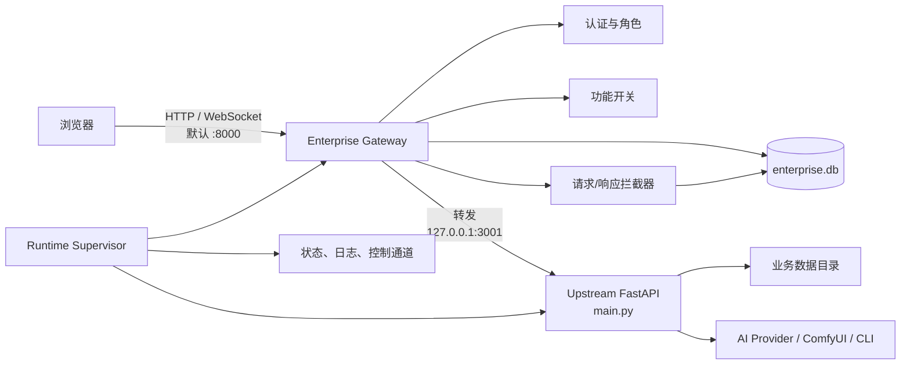
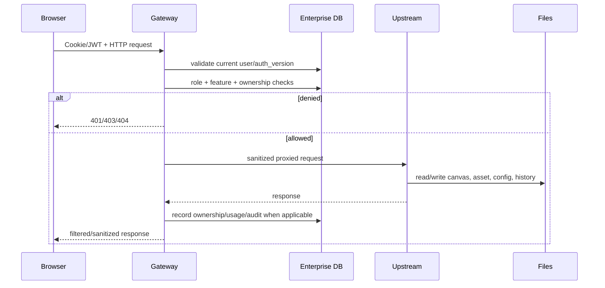
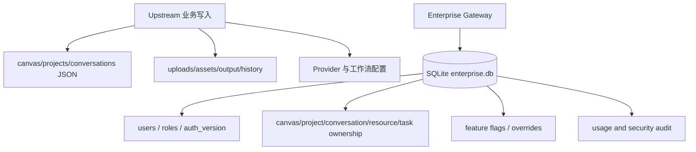
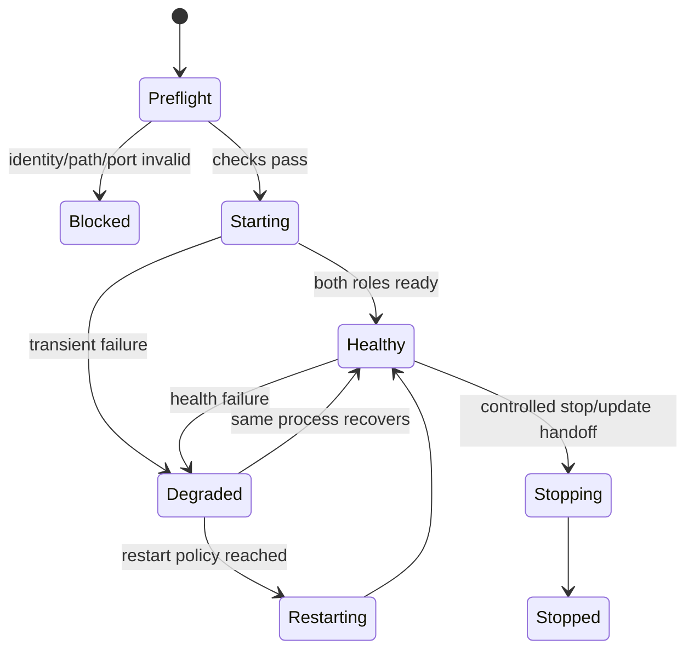

# 系统架构

[返回索引](./README.md)

## 1. 架构定位

项目采用“企业 Gateway 覆盖旧业务内核”的模块化单体结构：

- `main.py` 和 `static/` 保留原有无限画布业务与视觉交互。
- `enterprise/gateway.py` 是企业用户的唯一 HTTP/WebSocket 入口。
- Gateway 验证会话、检查功能权限、记录或过滤资源归属，然后把允许的请求转发给 loopback 上的 Upstream。
- `enterprise/db.py` 以 SQLite 保存企业身份、归属、功能开关和用量日志；画布、素材、配置等旧业务数据仍主要存放在文件目录。
- `enterprise/runtime/` 在 Windows 上管理 Gateway 和 Upstream 两个子进程，处理身份校验、端口占用、健康检查、退避与安全停止。
- `enterprise/release/`、`enterprise/fresh_install.py` 和 `enterprise/ops/update/` 管理可验证 Release、首次安装与在线更新。

它不是微服务，也不是以 PostgreSQL 为中心的云原生系统；当前实现针对单台 Windows 主机上的企业多人使用与可维护发布。

## 2. 运行拓扑



默认端口：

- Enterprise Gateway：`8000`
- Upstream：`3001`
- 浏览器应访问 `http://127.0.0.1:8000/`，不应把 Upstream 端口暴露给普通用户。

## 3. HTTP 请求链路



关键语义：

- 未登录 HTML 请求通常跳转到 `/enterprise/login`；API 请求返回认证错误。
- 普通用户访问他人资源时，多数资源型接口以 404 隐藏资源存在性；明确的功能权限拒绝可返回 403。
- 设置类响应会经过敏感字段脱敏，普通用户不能获得 Provider 密钥。
- 请求与响应拦截器承担现有企业隔离的大部分业务语义，Upstream 本身并非完整多租户应用。

## 4. WebSocket 链路

浏览器连接 Gateway 的 `/ws/{path}`。Gateway 再连接 Upstream WebSocket，并维护 `EnterpriseWsConnection`：

- 连接与用户身份、客户端 ID 绑定。
- 事件按画布、任务、历史和资源归属过滤。
- 管理员与普通用户具有不同可见范围。
- 断开的连接从注册表中移除；可广播在线统计、素材更新和生成结果。

这一层防止只在 HTTP 列表中隔离、却通过 WebSocket 泄漏其他用户任务结果。

## 5. 数据写入模型



这是“文件业务数据 + SQLite 企业元数据”的混合持久化。归属映射不会把全部画布内容搬入数据库，而是在 Gateway 侧为旧数据增加访问控制索引。

## 6. Runtime 生命周期



Supervisor 分别跟踪 Gateway 和 Upstream：进程 PID 只是身份的一部分，还会结合创建时间、可执行文件、端口监听和发布上下文，避免停止或接管无关进程。

## 7. 安装与更新架构

便携安装目录使用稳定写入根与不可变应用目录分离：

```text
<INSTALL_ROOT>/
├─ config/                 可写配置
├─ data/                   业务数据与 enterprise.db
├─ logs/                   Runtime/更新日志
├─ releases/<release_id>/  不可变 APP_ROOT
│  ├─ enterprise/
│  ├─ static/
│  ├─ python/
│  └─ release-manifest.json
└─ state/
   └─ current-release.json 当前版本指针
```

首次安装负责验证三件套、建立 Greenfield 数据与配置、发布 Release 并原子写入 current pointer。在线更新负责下载、校验、准备、确认密码、受控停机、切换 pointer、启动目标、健康检查；失败时尝试恢复源版本。

## 8. 信任边界

| 边界 | 可信输入 | 主要防护 |
| --- | --- | --- |
| 浏览器 → Gateway | 当前有效会话 | JWT、`auth_version`、角色、功能开关 |
| Gateway → Upstream | 仅 loopback 内部转发 | Gateway 统一拦截；Upstream 不应公网暴露 |
| Release → 安装/更新 | Manifest v2 与闭合 inventory | SHA-256、路径安全、ZIP 校验、固定仓库与资产名 |
| Runtime → 进程 | 受信 launch context | 固定 Python、进程身份、端口归属、Job Object |
| APP_ROOT → 写入目录 | 明确 PathRoots | 目录不重叠、同卷约束、reparse/symlink fail-closed |

## 9. 架构性质与适用范围

当前结构适合：Windows 单机部署、以浏览器访问、需要账号隔离、需要本地素材与 AI 工具接入、需要受控安装更新的团队环境。

当前结构不直接满足：多节点水平扩展、数百人高并发写入、跨地域容灾、PostgreSQL 多租户、分布式任务调度或零信任公网部署。相关限制见[已知限制](./09-known-limitations-and-maintenance.md)。
