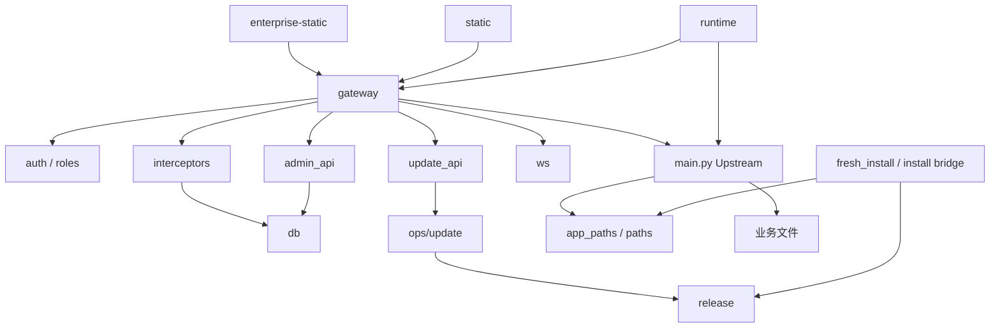

# 仓库结构与模块职责

[返回索引](./README.md)

## 1. 顶层目录

| 路径 | 职责 | 所有权/维护提示 |
| --- | --- | --- |
| `main.py` | 旧业务 FastAPI 内核；包含绝大多数 REST 路由、Provider 调用、文件持久化和页面服务 | 上游覆盖区，文件超大，修改需专项回归 |
| `static/` | 旧版产品 UI：工作台、普通画布、智能画布、素材与设置页 | 必须保留原视觉与交互；无前端构建步骤 |
| `enterprise/` | 企业认证、权限、Gateway、数据索引、Runtime、发布、安装、更新、安全审计 | 企业自有核心代码 |
| `enterprise-static/` | 登录、管理后台、操作日志、个人中心 | 由 Gateway 直接提供 |
| `enterprise/tests/` | Python 单元/集成/契约测试、PowerShell smoke/diagnose、浏览器清单 | 当前共 59 个 Python 测试文件 |
| `docs/` | ADR、实施记录、证据、路线与当前状态 | 历史记录不等于当前源码事实 |
| `tools/` | 运维、发布、验证、打包和历史工具 | 使用前阅读对应记录，避免把历史脚本当正式入口 |
| `installer/windows/` | Inno Setup Windows 安装器定义 | 首次安装分发入口 |
| `runtime/windows/` | 固定 CPython/依赖闭包的来源、哈希锁与构建策略 | 大型二进制通常不直接提交 |
| `release/windows/` | Windows Release/安装资产相关文件 | 与 Manifest 和 inventory 配套 |
| `packages/` | 已归档 wheel 等离线依赖素材 | 不是 npm package workspace |
| `workflows/` | 内置 ComfyUI 工作流 | 运行时可叠加用户自定义版本 |
| `data/` | 开发树中的示例或运行数据入口 | 正式 portable 模式应落在外部 DATA_ROOT |

## 2. `enterprise/` 主要模块

| 模块 | 主要职责 |
| --- | --- |
| `gateway.py` | 企业 FastAPI 入口、登录退出、健康接口、静态页、HTTP/WS 反向代理 |
| `auth.py` | 密码验证、JWT 创建与验证、认证用户装配 |
| `roles.py` | `user`、`admin`、`super_admin` 固定角色与兼容转换 |
| `db.py` | SQLite schema、用户、归属、任务、素材、功能开关、用量日志 |
| `interceptors.py` | 请求预处理、访问拒绝、响应过滤、敏感配置脱敏、归属记录 |
| `ws.py` | WebSocket 连接注册、事件可见性、定向发送与广播 |
| `admin_api.py` | 成员治理、归属调整、功能开关、日志与个人资料 API |
| `update_api.py` | 更新中心访问、检查、准备、执行、状态和诊断 API |
| `paths.py` | development/portable 路径根模型与安全校验 |
| `app_paths.py` | 把旧业务逻辑中的文件位置映射到 PathRoots |
| `config.py` | `enterprise.env` 读取、端口、JWT、DB、仓库、更新开关 |
| `resource_index.py` | 从结构化数据中提取本地资源 URL |
| `canvas_task_journal.py` | 画布任务受理回执的追加日志与恢复；仅本地当前分支新增 |
| `runtime/` | 双进程生命周期、健康、身份、控制、日志、便携启动 |
| `release/` | current pointer、Manifest v2、确定性静态树与 Windows Runtime 构建 |
| `ops/update/` | GitHub Release 获取、HTTPS 下载、准备作业、切换和回滚 |
| `migrations/` | 版本化 SQLite schema 状态、迁移计划、备份和恢复基础 |
| `security_audit.py` | 不可变安全审计表、校验与追加事件 |
| `security_bootstrap.py` | 角色/审计安全能力的计划、激活和恢复 |
| `security_user_governance.py` | 三角色下的用户变更、CAS、审计与会话失效 |
| `fresh_install.py` | Greenfield 首次安装事务 |
| `install_cli.py` | 开发/命令行安装入口 |
| `install_setup_bridge.py` | 安装器与固定 Python 间的受控 named-pipe 桥接 |

## 3. 静态前端结构

| 页面 | 主要脚本/样式 | 职责 |
| --- | --- | --- |
| `static/index.html` | 内联脚本 + `theme.js`、`i18n.js` | AI Studio 入口 |
| `static/canvas-list.html` | `canvas-list.js`、`canvas-list.css` | 项目与画布工作台 |
| `static/canvas.html` | `canvas.js`、`canvas.css`、`ltx-director-timeline.js` | 普通无限画布 |
| `static/smart-canvas.html` | `smart-canvas.js`、`smart-canvas.css` | 节点化智能画布与工作流 |
| `static/asset-manager.html` | `asset-manager.js`、`asset-manager.css` | 本地与画布素材管理 |
| `static/api-settings.html` | `api-settings.js`、`api-settings.css` | Provider、模型、CLI 与 RunningHub 设置 |
| `static/comfyui-settings.html` | `comfyui-settings.js` | ComfyUI 实例与工作流设置 |
| `static/angle.html` 等 | 页面内脚本和共享工具 | 专项图片生成/处理入口 |
| `enterprise-static/*.html` | 页面内脚本、共享主题 | 登录、后台、日志、个人中心 |

`static/js/canvas.js` 与 `static/js/smart-canvas.js` 都是数十万字节的单文件实现，包含状态、渲染、网络、拖拽、缩放、保存、Provider 参数和任务轮询；改动时应按用户行为切片，而不是一次性重写。

## 4. 依赖方向

应避免反向依赖：旧前端和 `main.py` 不应直接依赖管理后台实现细节；发布校验不应依赖已启动的业务服务；配置模块不应从旧 Upstream 配置反向导入秘密。

## 5. 代码边界

默认企业开发范围是 `enterprise/`、`enterprise-static/`、`enterprise/tests/` 和企业文档。`main.py`、`static/`、`workflows/` 等属于旧内核/上游覆盖区；当前已经存在少量经过审查的跨界改动，但这不意味着以后可无约束修改。

新增跨界改动前至少回答：

1. 能否在 Gateway/拦截器/路径适配层实现？
2. 是否会改变旧版前端视觉或交互？
3. 是否需要同步所有 Provider、画布和素材路径测试？
4. 是否破坏 immutable APP_ROOT 或 portable PathRoots？
5. 是否需要更新 `CODE_BOUNDARIES.md` 和上游同步记录？
