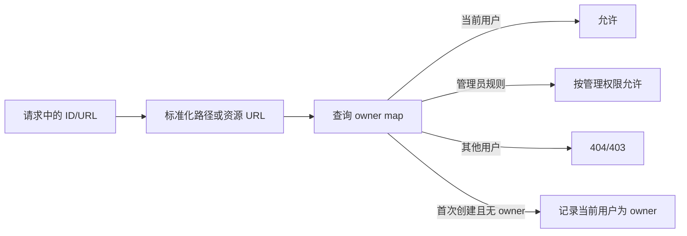

# 数据、权限与安全

[返回索引](./README.md)

## 1. 存储分层

| 数据类别 | 当前存储 | 说明 |
| --- | --- | --- |
| 用户、角色、会话版本 | SQLite `enterprise.db` | 企业身份事实源 |
| 资源归属、功能开关、用量 | SQLite `enterprise.db` | Gateway 权限索引 |
| 安全审计、schema 状态/迁移账本 | SQLite | 由安全/迁移模块扩展 |
| 项目、画布、对话 | JSON/业务文件 | 旧内核持久化 |
| 图片、视频、上传、输出、素材 | 文件目录 | 数据库只存归属与引用 |
| Provider/工作流配置 | 配置与工作流目录 | 返回前经企业层脱敏 |
| Runtime/更新状态 | STATE_ROOT/LOG_ROOT/STAGING_ROOT | 与 APP_ROOT 分离 |

## 2. 企业数据库表

基础 schema 主要包含：

| 表 | 用途 |
| --- | --- |
| `users` | 用户名、密码哈希、显示名、固定角色、启用状态、`auth_version` |
| `user_canvas_map` | 画布拥有者 |
| `user_project_map` | 项目拥有者、父级和可见性元数据 |
| `user_conversation_map` | 对话拥有者 |
| `user_resource_map` | 本地资源 URL 与拥有者 |
| `user_canvas_task_map` | 旧画布图片任务归属 |
| `user_task_map` | 通用任务类型、上游 ID、画布/工作流/资源与状态 |
| `user_history_map` | 生成历史归属 |
| `user_asset_object_map` | 素材库对象归属 |
| `usage_logs` | 用户操作/用量日志 |
| `enterprise_feature_flags` | 全局功能开关 |
| `enterprise_user_feature_overrides` | 单用户 inherit/allow/deny 覆盖 |
| `security_audit_events` | 安全敏感变更审计 |
| `enterprise_schema_state` | 当前 schema 版本与状态 |
| `enterprise_schema_migrations` | 已应用迁移账本 |

## 3. 认证模型

1. 用户在 `/enterprise/login` 提交用户名和密码。
2. 密码哈希校验通过后生成 JWT Cookie。
3. JWT 携带用户 ID、角色、过期时间和 `auth_version`。
4. 每次请求由 Middleware 重新读取数据库当前用户。
5. 用户不存在、禁用或 `auth_version` 不一致时返回 `STALE_AUTHENTICATION`。

这样可以在改密、改角色、停用用户后主动废止旧会话，而不是等 JWT 自然过期。

配置中的 `JWT_SECRET` 与初始管理员密码不得使用示例占位值。`ENTERPRISE_ENV=production` 或 `ENTERPRISE_STRICT_SECURITY=1` 会启用更严格的启动防护。

## 4. 固定三角色

| 角色 | 主要范围 |
| --- | --- |
| `user` | 访问自身项目、画布、对话、素材、任务和允许的业务功能 |
| `admin` | 普通成员治理、资源归属和管理页面，但不能执行超级管理员专属治理 |
| `super_admin` | 管理管理员、系统更新等高风险操作 |

当前是固定角色矩阵，不是动态 RBAC，也没有组织/部门层级权限模型。

## 5. 功能开关

有效值由全局开关和用户覆盖组合：

- `inherit`：继承全局值。
- `allow`：显式允许。
- `deny`：显式拒绝。

已使用的典型键包括 API 设置、工作流设置、RunningHub/视频/图片工具、素材管理、历史删除、本地资源管理和 `system_update`。界面隐藏只用于体验；Gateway 服务端仍必须再次执行 `can_use_feature()`。

系统更新是特殊高风险能力：

- 页面查看：`admin` 或 `super_admin`。
- 实际检查/准备/执行：必须是当前 `super_admin`。
- 还要求 `ENTERPRISE_UPDATE_ENABLED=true` 且 `system_update` 有效允许。
- 执行时重新验证当前密码，密码不写入作业、日志或审计。

## 6. 资源访问裁决

企业层通过拥有者映射包裹旧业务文件：

注意：首次认领只适用于明确的新建响应或安全的兼容场景，不能让任意用户通过猜测旧 ID 抢占资源。

## 7. 请求、响应与事件三层隔离

| 层 | 负责内容 |
| --- | --- |
| 请求前 | 拒绝直接 ID、校验功能和资源、限制设置写入 |
| 响应后 | 过滤列表、脱敏配置、记录新对象与结果资源归属 |
| WebSocket | 按任务、历史、资源和 client_id 过滤推送 |

只实现其中一层是不完整的。例如任务查询被隔离但 WebSocket 广播未隔离，仍会泄漏任务状态和生成结果。

## 8. 浏览器与代理边界

- 上游 HTTP 仅接受显式登记的方法/路径；路由清单与 `main.py` 装饰器由测试双向比对，未知 API 不得因静态文件后缀或 catch-all 自动转发。
- Cookie 认证的 `POST/PUT/PATCH/DELETE` 必须携带与请求 `scheme + Host` 精确一致的 `Origin`；Bearer CLI 不依赖浏览器 Cookie，不套用该 Cookie-CSRF 判定。
- 登录接口允许无 Origin 的非浏览器客户端，但只要提供 Origin 就必须同源；失败尝试按用户名摘要和来源地址执行有界内存限流。
- HTTPS 请求设置 `Secure` 会话 Cookie；HTTP 局域网开发仍可工作。TLS 终止和受信代理配置属于部署边界，不能通过任意客户端 `X-Forwarded-*` 推断。
- 登录 `next` 只允许站内单斜杠路径；登出使用 POST；企业静态文件必须解析后仍位于固定根目录。
- WebSocket 只接受同源 `/ws/stats`，客户端只发送 `ping`，服务端未知/缺失事件类型默认拒绝。

## 9. 安全审计

高风险用户治理使用调用者拥有的数据库事务，同时写入业务变化和 `security_audit_events`。审计内容要求：

- actor 必须是有效当前主体。
- action 与对象标识受限且结构化。
- 上下文有长度上限。
- 递归拒绝密码、Token、Cookie、Authorization 和 Provider 密钥字段。
- 表通过触发器保持 append-only 语义。

普通 `usage_logs` 不应替代强安全审计，两者证据等级不同。

## 10. SQLite 迁移基础

DATA-MVP-1 引入：

- 当前 schema 状态和迁移账本。
- 注册表驱动、版本顺序确定的事务迁移。
- 迁移前一致性 SQLite 备份，以及恢复时的 expected-current 数据库 SHA 与 expected-manifest SHA 双重绑定。
- 中断/失败回滚和启动/健康失败恢复原语。
- 并发迁移一胜一拒绝、重复 operation ID 不覆盖历史备份。

当前在线更新仍只接受同 Schema/无 migration 的 Manifest；“迁移基础已存在”不等于“管理后台已能安全执行任意数据库升级”。

## 11. 数据安全边界

- SQLite 文件与业务素材必须由操作系统 ACL 和安装目录权限保护。
- Upstream 应只监听 loopback；否则请求可绕过 Gateway。
- Gateway 本身不提供公网 TLS 终止；公网/跨网段使用需另有反向代理和网络边界。
- 备份、日志、更新诊断必须脱敏，不能包含密码、Token、Cookie 或 Provider 密钥。
- 当前没有 PostgreSQL RLS；跨用户隔离依赖 Gateway/SQLite 归属映射与测试矩阵。
