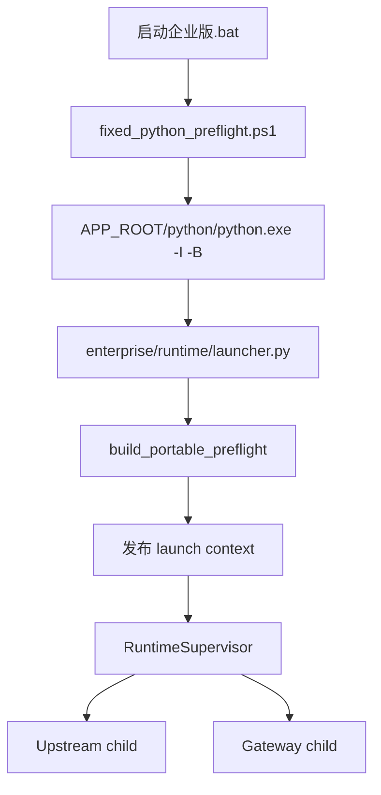
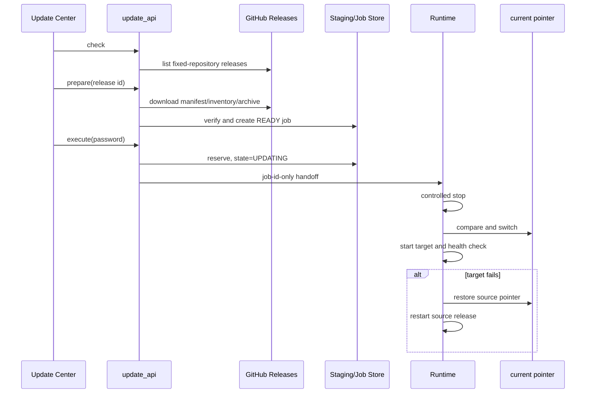

# Runtime、安装、发布与在线更新

[返回索引](./README.md)

## 1. PathRoots

`enterprise.paths.PathRoots` 将应用代码与可写状态分离。主要根包括 APP、CONFIG、DATA、LOG、STATE、STAGING、BACKUP、运行时 Python、上传、输出、素材、画布、对话和工作流等。

两种 profile：

- `development`：从源码目录推导，便于开发运行。
- `portable-release`：从 `<INSTALL_ROOT>` 与 current pointer 解析，APP_ROOT 指向 `releases/<release_id>`。

校验包含路径包含关系、目录重叠、同卷要求、Windows 特殊路径、符号链接/reparse point、可写探针和进程全局根一致性。

## 2. Runtime 关键类型

| 文件/符号 | 责任 |
| --- | --- |
| `supervisor.py / SupervisorConfig` | 端口、路径、模式、发布身份和日志配置 |
| `supervisor.py / RoleRuntime` | 单个 Gateway/Upstream 子进程状态 |
| `supervisor.py / RuntimeSupervisor` | 启动、监测、退避、停止、重启与控制命令 |
| `control.py / RuntimeController` | 面向 CLI 的 start/stop/restart 控制 |
| `control.py / inspect_runtime()` | 汇总 state、进程身份、端口与健康结果 |
| `state.py / RuntimeStateStore` | 原子状态读写、锁和 generation |
| `process.py / CommandSpec` | 固定子进程命令定义 |
| `process.py / ManagedProcess` | `Popen` 与进程身份封装 |
| `ownership.py / ProcessIdentity` | PID、创建时间、可执行路径身份 |
| `ownership.py / PortListenerSnapshot` | 端口监听者快照 |
| `health.py / HealthResult` | TCP/HTTP 探针结果 |
| `logging.py / RotatingTextLog` | 有界轮转文本日志与脱敏 |
| `windows.py / ProcessJob` | Windows Job Object 约束子进程 |

本地 `28ad937` 增量把健康探针放入隔离执行路径，避免健康检查本身阻塞 Supervisor 主循环；短暂健康失败可先进入 degraded，由同 PID 自愈，达到策略条件后才执行退避重启。

## 3. Portable 启动信任链

关键约束：

- 只接受当前 Release 内固定 `python.exe`。
- 使用 `-I -B`，并清除 `PYTHONHOME`、`PYTHONPATH` 等污染。
- Manifest、payload tree、Runtime manifest、启动核心文件和 Python identity 必须匹配。
- 端口若被无关监听者占用则 fail closed，不直接杀未知进程。
- `launch_context` 将一次预检的身份绑定到实际 service-host 进程。

## 4. 正式批处理入口

| 文件 | 命令 |
| --- | --- |
| `启动企业版.bat` | portable `start` |
| `停止企业版.bat` | portable `stop` |
| `重启企业版.bat` | portable `restart` |
| `查看企业版状态.bat` | portable `status` |
| `企业版健康检查.bat` | portable `health` |

`enterprise.runtime.cli` 还定义 `foreground` 和内部 `service-host`；后者需要可信 instance ID 与 launch-context identity，不是人工常规入口。

根目录 `run.bat`、`启动服务.bat` 直接运行 `main.py`，属于旧 Upstream/开发入口，会绕开企业登录与权限，不应作为企业正式启动方式。

## 5. Release 模型

### `enterprise/release/current_release.py`

`CurrentRelease` 描述当前 release ID 与前序信息；读取函数严格解析 `state/current-release.json`，写入使用临时文件、身份校验、原子替换和目录同步分类。

### `enterprise/release/release_manifest_v2.py`

核心类型：

- `ReleaseManifestV2`：固定 schema 的发布身份、归档、payload、Runtime、静态树、配置和数据库契约。
- inventory 项：路径、大小、SHA-256 等。
- 构建/解析/验证/materialize 函数：拒绝绝对路径、穿越、重复、ADS、设备名、symlink/reparse 和闭包外文件。

### `release_builder_v2.py` 与 `static_build.py`

从干净 Git 身份构建确定性静态树和 Release archive，绑定 commit/tree/manifest/inventory，避免从脏工作区制作不可追溯发布包。

### Windows Runtime

`windows_runtime_build.py` 和 `runtime/windows/` 策略固定 CPython 3.14 x64、哈希 requirements、wheelhouse 闭包、pip-check、SBOM、来源与可复现构建证据。源码工作区内另有开发用 Python 3.10.11，不应与正式 portable Runtime 混为同一个信任对象。

## 6. 首次安装

`fresh_install.py` 的主要阶段：

1. 校验 manifest、inventory 和 archive。
2. 校验安装根、路径不重叠、固定磁盘与 reparse 边界。
3. 创建 config/data/log/state/releases 等目录。
4. materialize 不可变 Release。
5. 创建 Greenfield SQLite 数据库和首个超级管理员。
6. 写入 `enterprise.env` 与 current pointer。
7. 失败时只清理本次拥有的对象，不删除外部未知文件。

`install_setup_bridge.py` 通过当前用户 SID 约束的 named pipe 接收安装器输入，避免在命令行或环境变量中暴露密码。

## 7. 在线更新

核心组件：

- `GitHubReleasesProvider`：只接受固定 GitHub 仓库、Manifest v2 Release 和精确资产集合。
- `SafeHttpClient`：限定 HTTPS、Host 和重定向；跨 Host 去除敏感请求头。
- `atomic_download()`：限制大小，边下载边哈希，完成后原子发布。
- `UpdateJobStore`：持久化 plan/status/events，限制单个活动执行保留。
- `UpdateMvpService`：准备并验证同 Schema 更新。
- `execute_update_job()`：pointer 切换、启动/健康和回滚。
- `request_portable_update_handoff()`：只把 job ID 交给 Supervisor 控制通道。

## 8. 更新限制

- 当前在线更新只支持相同数据库契约、无需迁移的单跳升级。
- DATA-MVP-1 的迁移/恢复原语尚未完整接入 Update Center。
- 更新回滚主要恢复代码 Release/current pointer；不能把它描述成任意数据迁移回滚。
- 更新中心只消费完整 Manifest v2 Release，不消费 GitHub 源码 ZIP。
- 诊断输出有界并脱敏，但仍应按内部运维材料处理。
