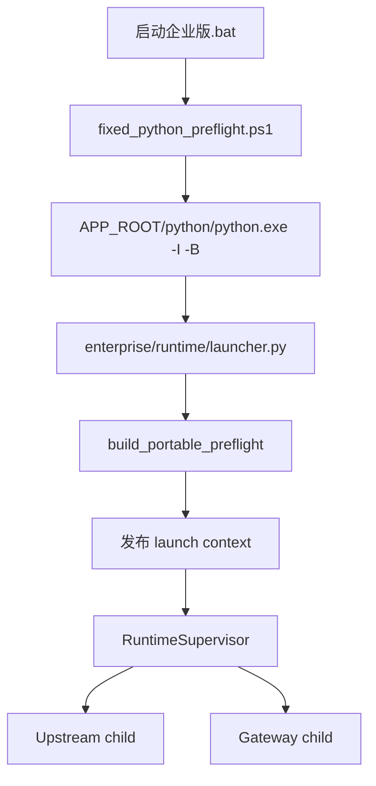
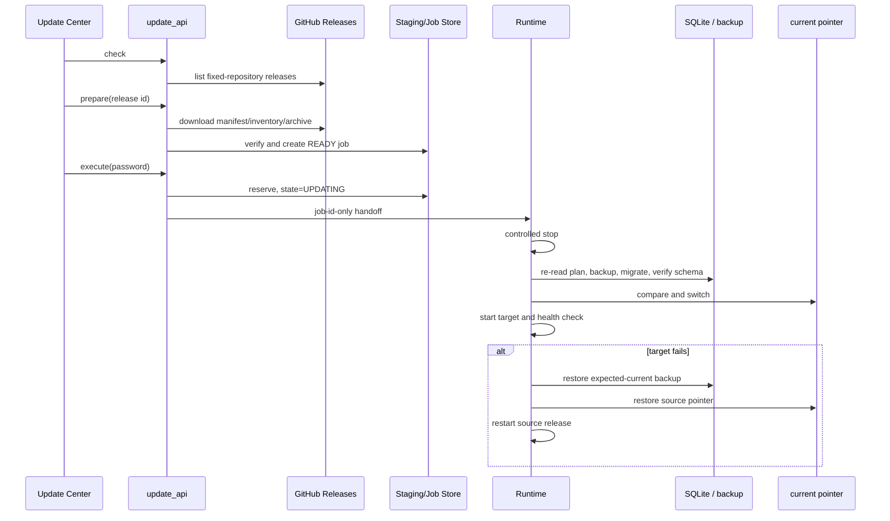

# Runtime、安装、发布与在线更新

[返回索引](./README.md)

更新时间：2026-10-09。主线、维护线和固定入口边界见 [CURRENT](../CURRENT_PROJECT_STATUS.md)，生命周期设计见 [统一交付 ADR](../decisions/ADR-DELIVERY-001-UNIFIED-INSTALL-UPDATE-LIFECYCLE-2026-10.md)。

## 1. PathRoots

`enterprise.paths.PathRoots` 将应用代码与可写状态分离。主要根包括 APP、CONFIG、DATA、LOG、STATE、STAGING、BACKUP、运行时 Python、上传、输出、素材、画布、对话和工作流等。

两种 profile：

- `development`：从源码目录推导，便于开发运行。
- `portable-release`：从 `<INSTALL_ROOT>` 与 current pointer 解析，APP_ROOT 指向 `releases/<release_id>`。

校验包含路径包含关系、目录重叠、同卷要求、Windows 特殊路径、符号链接/reparse point、可写探针和进程全局根一致性。

## 2. Runtime 关键类型

| 文件/符号 | 责任 |
| --- | --- |
| `supervisor.py / SupervisorConfig` | 端口、路径、模式、发布身份和日志配置 |
| `supervisor.py / RoleRuntime` | 单个 Gateway/Upstream 子进程状态 |
| `supervisor.py / RuntimeSupervisor` | 启动、监测、退避、停止、重启与控制命令 |
| `control.py / RuntimeController` | 面向 CLI 的 start/stop/restart 控制 |
| `control.py / inspect_runtime()` | 汇总 state、进程身份、端口与健康结果 |
| `state.py / RuntimeStateStore` | 原子状态读写、锁和 generation |
| `process.py / CommandSpec` | 固定子进程命令定义 |
| `process.py / ManagedProcess` | `Popen` 与进程身份封装 |
| `ownership.py / ProcessIdentity` | PID、创建时间、可执行路径身份 |
| `ownership.py / PortListenerSnapshot` | 端口监听者快照 |
| `health.py / HealthResult` | TCP/HTTP 探针结果 |
| `logging.py / RotatingTextLog` | 有界轮转文本日志与脱敏 |
| `windows.py / ProcessJob` | Windows Job Object 约束子进程 |

主线收敛分支同时包含 `28ad937` 的阻塞隔离/任务回执，以及 `2026.09.4` 现场验证后的全新无 keep-alive 探针、并发单飞、外层截止与启动宽限保持。短暂 readiness 失败先进入 degraded 并允许同 PID 自愈，只有真正的 liveness/稳态连续失败达到策略条件后才退避重启。主要修复已通过 PR #108 合并，不等于每个旧发布包都包含。

## 3. Portable 启动信任链

下图为源码/旧安装 BAT 兼容链路。固定原生入口 #138、安装接线及入口专用修复 #139 已选择性回归 main，不绑定应用目标，不另写 Runtime；这不是完整安装维护产品交付。

`installer/windows/native/` 用 C# 处理固定入口、Windows UI 和受限进程调用：读取 `state/current-release.json`，校验 Manifest 与完整 inventory，再调用该 Release 内 `python/python.exe -I -B enterprise/runtime/launcher.py portable <command>`。`tools/build_native_entry.py` 使用外置固定编译器双构建，仅生成全新 artifact 根，不写客户安装、不迁移数据库。构建、安装器接线和真实 Runtime 验收必须区分，见 [实施记录](../ops/DELIVERY-1-FIXED-NATIVE-ENTRY-2026-10.md)。

```mermaid
flowchart TD
    BAT[启动企业版.bat] --> PS[fixed_python_preflight.ps1]
    PS --> PY[APP_ROOT/python/python.exe -I -B]
    PY --> L[enterprise/runtime/launcher.py]
    L --> P[build_portable_preflight]
    P --> C[发布 launch context]
    C --> S[RuntimeSupervisor]
    S --> U[Upstream child]
    S --> G[Gateway child]
```

关键约束：

- 只接受当前 Release 内固定 `python.exe`。
- 使用 `-I -B`，并清除 `PYTHONHOME`、`PYTHONPATH` 等污染。
- Manifest、payload tree、Runtime manifest、启动核心文件和 Python identity 必须匹配。
- 端口若被无关监听者占用则 fail closed，不直接杀未知进程。
- `launch_context` 将一次预检的身份绑定到实际 service-host 进程。

## 4. 源码/旧安装兼容批处理入口

| 文件 | 命令 |
| --- | --- |
| `启动企业版.bat` | portable `start` |
| `停止企业版.bat` | portable `stop` |
| `重启企业版.bat` | portable `restart` |
| `查看企业版状态.bat` | portable `status` |
| `企业版健康检查.bat` | portable `health` |

`enterprise.runtime.cli` 还定义 `foreground` 和内部 `service-host`；后者需要可信 instance ID 与 launch-context identity，不是人工常规入口。

根目录 `run.bat`、`启动服务.bat` 直接运行 `main.py`，属于旧 Upstream/开发入口，会绕开企业登录与权限，不应作为企业正式启动方式。

## 5. Release 模型

### `enterprise/release/current_release.py`

`CurrentRelease` 描述当前 release ID 与前序信息；读取函数严格解析 `state/current-release.json`，写入使用临时文件、身份校验、原子替换和目录同步分类。

### `enterprise/release/release_manifest_v2.py`

核心类型：

- `ReleaseManifestV2`：固定 schema 的发布身份、归档、payload、Runtime、静态树、配置和数据库契约。
- inventory 项：路径、大小、SHA-256 等。
- 构建/解析/验证/materialize 函数：拒绝绝对路径、穿越、重复、ADS、设备名、symlink/reparse 和闭包外文件。

### `release_builder_v2.py` 与 `static_build.py`

从干净 Git 身份构建确定性静态树和 Release archive，绑定 commit/tree/manifest/inventory，避免从脏工作区制作不可追溯发布包。

统一基线默认 snapshot 为正式 09.9/10.1 同源 v2。构建参数 `--database-contract-mode` 支持默认 `same-schema-no-migration`、明确改表的 `versioned-forward-migration`，以及维护构建的 `same-versioned-schema-no-migration`（wire 仍为同结构/code-pointer）。构建模式不能代替准确 source/target route、registry 和安装副本验收；本轮不改 VERSION、不发布新包。

### Windows Runtime

`windows_runtime_build.py` 和 `runtime/windows/` 策略固定 CPython 3.14 x64、哈希 requirements、wheelhouse 闭包、pip-check、SBOM、来源与可复现构建证据。源码工作区内另有开发用 Python 3.10.11，不应与正式 portable Runtime 混为同一个信任对象。

## 6. 首次安装

以下为 fresh-install 实现，不是完整更新/修复/卸载产品。主线 #139 已将快捷方式指向 `<INSTALL_ROOT>/InfiniteCanvas.exe`，新装要求与 Release 同 commit/tree 的独立原生构建。`Uninstallable=no` 暂留，标准卸载是后续明确待办；已公开客户包不因主线合并自动变化。

`fresh_install.py` 的主要阶段：

1. 校验 manifest、inventory 和 archive。
2. 校验安装根、路径不重叠、固定磁盘与 reparse 边界。
3. 创建 config/data/log/state/releases 等目录。
4. materialize 不可变 Release。
5. 创建 Greenfield SQLite 数据库和首个超级管理员。
6. 发布配置、数据库和可选固定入口/实例记录；current pointer 最后发布。
7. 失败时只清理本次拥有的对象，不删除外部未知文件。

数据库创建前重新校验已 materialize 的 schema evidence 哈希，按受支持的 v1/v2 版本和精确 registry 初始化；创建后核对 schema 哈希、版本和账本。无版本/未知 evidence 拒绝新装，不靠显示版本猜测，不删除主线的固定入口、最大密码长度或最终 pointer 发布保护。

`install_setup_bridge.py` 通过当前用户 SID 约束的 named pipe 接收安装器输入，避免在命令行或环境变量中暴露密码。

### 已接线的入口专用修复

`enterprise.install_entry` 只负责固定入口和实例元数据，不是第二套数据库/升级引擎：

- `state/installation.json` 保存独立 UUID、角色/范围、位置、相对数据/配置路径、更新协议、通道和原生构建身份；不复制当前应用版本，版本只认 current pointer。
- HKCU 本产品子键是定位提示，不是可信安装证据；最多读取 32 条，不扫描所有磁盘。一个已登记位置优先使用原处，多个要求选择；未登记历史位置需显式选择并校验。
- `repair-entry` 完整核验当前 Release 和未完成恢复作业，只发布根 EXE 与 STATE_ROOT 元数据/入口备份，不打开数据库、不改变当前指针、不创建管理员。
- 共用 `system-update-active.lock`，原文件和写入文件都以内容＋文件身份约束；中途失败只恢复本次拥有的两个入口文件。未知文件、移位实例记录、重解析或已有锁阻断。
- 不能证明入口恢复时保留锁及备份，不能删锁试错；入口旧锁的崩溃恢复与图形恢复仍待完成。下面的程序修复不接管这些旧锁。
- 新装对未支持的过深目的路径做写入前阻断，不更改 Windows 长路径策略；这不是宣称已兼容任意长路径。

本轮增量候选在环境页与最后准备页明确安装根和“只修复入口、不是业务升级”的范围，不填写旧安装管理员密码；最终仍由 Python 完整核验，不以页面目录形状替代资格。真实安装副本/服务测试入口与其权限和证据边界见 [测试说明](../../enterprise/tests/README.md)。portable host 的路径修正保留 containment 校验，同时维持可信 KnownFolder 的原目录身份，避免 Windows 目录重定向被 `resolve()` 替换后导致 context 不匹配；不放宽完整进程/文件身份校验。

### 同 Release 程序/Python 修复与图形维护候选

`enterprise.install_repair` 提供 `repair_program()` / `recover_program()`，已由 #141 合并到 main，保留 v3 named-pipe handler。新候选将 Inno 的程序修复/恢复/只读状态接入 v4，v1/v2/v3 仍兼容。它复用 Manifest v2 资产校验/物化、既有安装身份和 Runtime；不是第二套业务升级/数据库引擎。

- 只接受已登记实例、准确 current pointer 与同一 Manifest 的外部完整资产；允许已知程序文件损坏或缺失，不把未知额外文件/目录当本项目文件搬走。
- 服务必须已停止，任务确认必须显式为 true。读取当前用户 Runtime 状态/进程/端口，未知状态阻止；不杀进程或删除旧锁。维护 fence 与启动预约后复查防止修复/启动竞争。
- 在 `staging/program-repairs/<操作短 ID>/` 准备完整候选、不可改写的 plan/result 和 kernel lease。执行器退出由操作系统释放 lease；第二执行器不能抢占仍存活的操作。
- 只替换停止状态的当前程序目录；保留 original/rejected 作为证据，不改数据库、配置、素材、画布、账号、根 EXE、实例记录或版本指针。
- 中断后只恢复自身 plan/hash/文件身份一致的事务。已记录成功且新树一致时完成释放；成功记录前恢复修复前原树。**回退到原损坏树不等于已修好**，可在核验后再次修复。身份/指针/备份/锁变动时保留阻断，不能猜测清理。

`enterprise.install_repair_status` 是展示层，不是事务授权来源：

- `RepairProgress` 在 STATE_ROOT 保存当前操作索引，在该操作的 STAGING_ROOT 保存绑定身份、指针、原树与 runner 的阶段。phase 不代替不可改写的 plan/result，也不能证明修好。
- `inspect_program_repair()` 只观察已知事务，不执行恢复；OS lease 存活表示仍在运行，执行器退出且维护锁未释放表示需要恢复。只有匹配结果与程序树才能报告成功/已回退；旧 v3 没有进度文件的已知 plan 也能查看与恢复。
- v4 进度通过同 SID 管道显示 allow-list 阶段；断开只结束查看，不杀后台执行器、不触发回退。重新打开向导可选择只读状态，运行中显示当前阶段，回退明确提示原损坏可能仍在。
- 向导将外部解释器完整包放在本产品当前用户 `maintenance-payloads` 缓存下，避免关闭 Setup 时删除仍运行的解释器。重解析/空间校验不省略；缓存清理尚待拥有者与活跃任务核验，不能按目录名称自动删除。
- 程序维护不执行快捷方式、安装登记或数据库写入；只有新装/入口修复才进入对应后续步骤。图形按钮接入与编译通过不等于真实图形点击验收。

本候选不实现应用升级、数据库迁移、历史无身份接管、入口旧锁接管、多跳/更新器自身更新或标准卸载，也不声称断电/磁盘硬件故障恢复已验收。准确提交和安装副本证据见 DELIVERY-1 第 8–9 节。

## 7. 在线更新

```mermaid
sequenceDiagram
    participant UI as Update Center
    participant API as update_api
    participant GH as GitHub Releases
    participant ST as Staging/Job Store
    participant RT as Runtime
    participant DB as SQLite / backup
    participant PTR as current pointer

    UI->>API: check
    API->>GH: list fixed-repository releases
    UI->>API: prepare(release id)
    API->>GH: download manifest/inventory/archive
    API->>ST: verify and create READY job
    UI->>API: execute(password)
    API->>ST: reserve, state=UPDATING
    API->>RT: job-id-only handoff
    RT->>RT: controlled stop
    RT->>DB: re-read plan, backup, migrate, verify schema
    RT->>PTR: compare and switch
    RT->>RT: start target and health check
    alt target fails
        RT->>DB: restore expected-current backup
        RT->>PTR: restore source pointer
        RT->>RT: restart source release
    end
```

核心组件：

- `GitHubReleasesProvider`：只接受固定 GitHub 仓库、Manifest v2 Release 和精确资产集合。
- `SafeHttpClient`：限定 HTTPS、Host 和重定向；跨 Host 去除敏感请求头。
- `atomic_download()`：限制大小，边下载边哈希，完成后原子发布。
- `UpdateJobStore`：持久化 plan/status/events，限制单个活动执行保留。
- `UpdateMvpService`：准备并验证同 Schema或显式版本化迁移更新，持久化数据库计划。
- `execute_update_job()`：重读迁移证据、备份/迁移、pointer 切换、启动/健康、数据库恢复和代码回滚。
- `request_portable_update_handoff()`：只把 job ID 交给 Supervisor 控制通道。

## 8. 更新限制

- Update Center 支持相同 Schema 单跳升级，以及经过 registry、Manifest v2 和当前数据库身份共同约束的版本化前向迁移。
- 版本化迁移在 pointer 切换前创建一致性备份；目标启动或健康失败时按 expected-current 约束恢复数据库、pointer 和 source Runtime。
- 如果迁移已提交但结果尚未返回就发生异常，不能凭 `MigrationResult` 缺失推断数据库未改变；执行器必须复核持久化的 source pointer 与 schema 身份，无法证明一致时进入 `RECOVERY_REQUIRED`，不得启动旧版。
- `RECOVERY_REQUIRED` 表示无法证明三者已经恢复一致，不能自动重试或伪装成普通失败。
- 维护线已发布 09.9 改表目标，并有测试设备受控桥接成功反馈，不外推 main 已统一交付或全部客户批准。
- 当前候选目录最多最近 50 Release、规划最多 8 跳，没有一次确认自动多跳。09.6 治理激活状态不能由旧更新器直接识别，不删审计对象绕过。
- 完整通知/任务和业务写入隔离、更新器自更新及图形恢复仍待落地；业务写入已开放后不盲目回旧备份。
- 更新中心只消费完整 Manifest v2 Release，不消费 GitHub 源码 ZIP。
- 诊断输出有界并脱敏，但仍应按内部运维材料处理。
